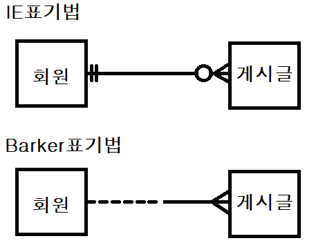

# ERD 테이블 설계 관계
> [[after interview#기술면접|면접]]에서 테스트할 때 ERD 설계에서 헤맷던 부분을 보충하기 위해 만듦  
> 
## 관계 차수
1:1 (@OneToOne) / 1:N (@OneToMany) / M:N(@ManyToMany)

## 관계 선택 사양 (Optionality) 

[[Information Engineering Notation|IE(Information Engineering Notation 정보공학 표기법)]]와  
[[Barker]]표기법을 흔히쓴다

## 1:1 (@OneToOne) 
#### 일 : 일 관계
> 예시 : 사람1과 주민번호1  
> 한 명의 사람은 중복되지 않는 주민번호 1개 만을 소지할 수 있다

## 1:N (@OneToMany)
#### 일 : 다 관계
> 예시 : 회원정보1와 게시글N을 예로 들 수 있다  
> 한개의 회원은 여러개의 게시글을 쓸 수 있으며  
> 게시글은 회원의 정보를 받아오므로 게시글은 회원을 참조.  

> 이 사진은 게시글이 회원정보를 참조한 1:N관계 를 나타낸다  
> 또한 회원은 게시글이 필수가 아니므로 위와 같이 표기할 수 있다  
> 즉 회원의 입장에서는 게시글이 0개 이상이면 되고(필수가 아님)  
> 게시글은 회원 1개가 필수라는것

## M:N (@ManyToMany)
#### 다:다 관계
> 잘 지양하지 않는 방법  
> 예시 :  고객N과 여행상품M  
> 한명의 고객은 여러개의 상품을 예매할 수 있고 상품 한개는 여러명의 고객이 구매할 수 있다
> N:M은 테이블을 하나 더 만들어 1(고객):N , M:1(여행상품) 으로 관리하는것이 바름직 하다  
> 예를 들어 고객1-고객,상품참조 테이블 N - 여행상품1 이런식으로 관리
> 

