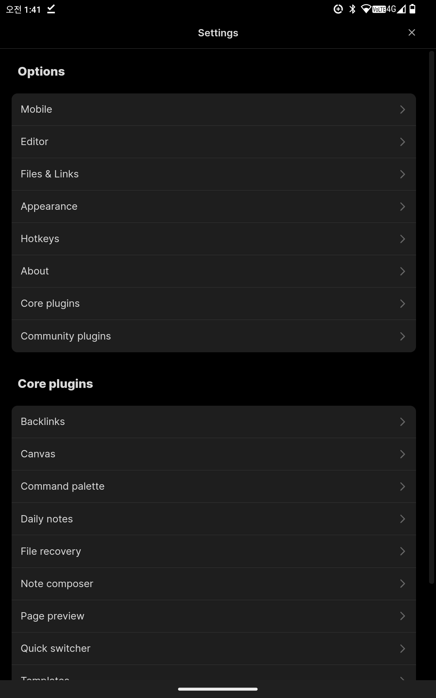
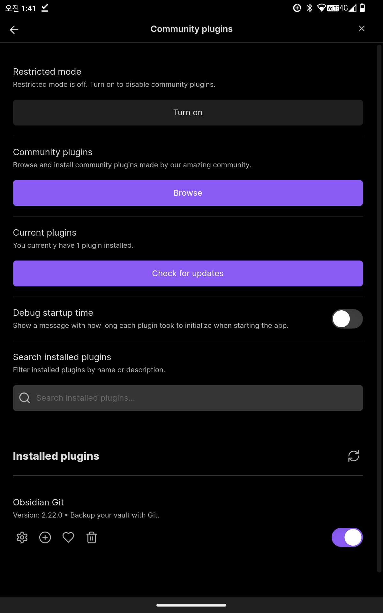
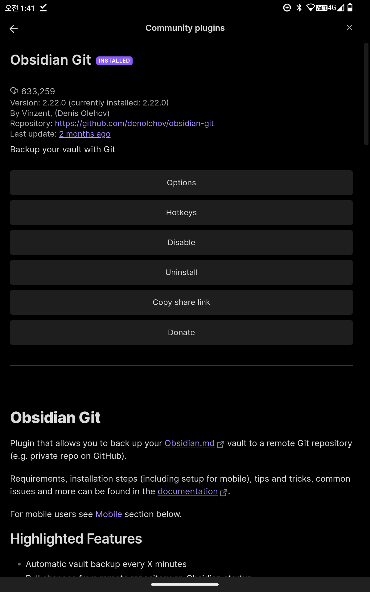

#  옵시디언 사용하기

>  옵시디언 써보겠다고 귀중한 6시간을 낭비했다
>  Good ..

>  플레이스토어에 obsidian 을 검색하여 앱을 다운 받은 후
>  실행을 하면 총 세계의 메뉴가 보이는데 그 중 두번째 메뉴인
>  New vault ~~~ 로 디렉토리를 만들어준다
>  그 후 좌측 상단에 있는 버튼을 눌러 아래 화면과 같이 진행한다

### Community plugins 에 들어가

###  상단 첫번째 turn on 클릭 후 두번째 커뮤니티 플러그인에 browse

### 여기 화면에 option이라 써있는 저 부분이 enable로 되어있는데 사용함 체크하면 저렇게 바뀐다 이제 다시 나와서

### 위의 창을 아래로 드래그하면 아래 사진과 같은 창이 나오는데 그 창에 init을 입력하여 
