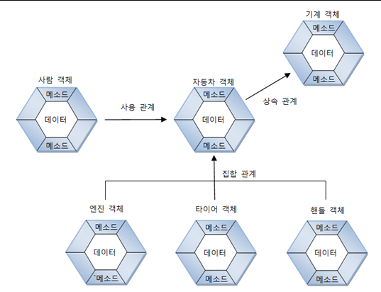

#집합관계 #사용관계 #상속관계 
### 의미
> 객체는 단독으로도 존재할 수 있지만 대부분 다른 객체와 관계를 맺고 있다.  
> 관계의 종류에는 집합 관계, 사용 관계, 상속 관계 등이 있다.

#### 집합 관계
> 완성품과 부품의 관계를 예로 들 수 있다  
> 예를 들어 선풍기는 모터, 휀, 조작버튼, 케이스 등으로 구성되어 있고  
> 이 부품들과 선풍기는 집합 관계라고 볼 수 있다.

#### 사용 관계
> 다른 객체의 필드를 갖고오거나 변경 또는 메소드를 호출하는 관계를 뜻한다.
> 예를 들어 Spring Boot에서 Controller에서 다른 Service의 메소드를 호출 하는것.

#### 상속 관계
> 부모와 자식 관계를 말한다.  
> 상속받은 자식은 부모의 메소드, 필드 등이 사용 가능하다.

#### 객체간의 관계

